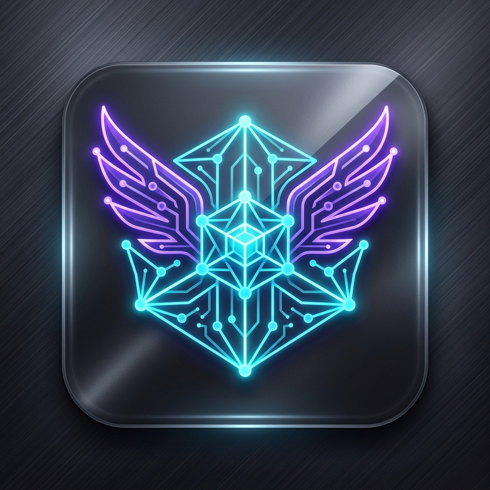

# 🚀 Nexus Autopilot

  

  <strong>ระบบ Autopilot อัจฉริยะสำหรับ Google Antigravity IDE & VS Code</strong> 
  คลิกปุ่มอัตโนมัติ (Run, Allow, Accept ในแชต) • เลื่อนหน้าจออัจฉริยะ (Smart Auto Scroll) • รองรับหลายหน้าต่าง (Multi-Instance) • ซ่อม Checksum อัตโนมัติ • ภาษาไทย 100%

  
  
  
  

---

## 🌟 จุดเด่นและฟีเจอร์หลัก (Key Features)

### 1. ⚡ ระบบคลิกอัตโนมัติอัจฉริยะ (Smart Auto Click)
- ตรวจจับและคลิกปุ่ม **Run**, **Allow**, **Always Allow**, **Keep Waiting** และ **Accept** โดยอัตโนมัติ
- **ปลอดภัย 100%**: แยกแยะปุ่ม *Accept* เฉพาะในหน้าต่างแชต (Chat Panel) เท่านั้น โดย **ไม่คลิกใน Diff Editor เด็ดขาด** ป้องกันการกดรับโค้ดใน editor โดยไม่ตั้งใจ

### 2. 📜 ระบบเลื่อนจออัจฉริยะ (Smart Auto Scroll)
- เลื่อนหน้าต่างแชตลงมาอัตโนมัติอย่างนุ่มนวล ขณะที่ Agent กำลังสร้างคำตอบ
- ใช้ `MutationObserver` ตรวจจับการเปลี่ยนแปลงในแชตแบบเรียลไทม์
- **ตรวจจับการเลื่อนจอด้วยตนเอง**: หากคุณเลื่อนจอขึ้นเพื่ออ่านเนื้อหา ระบบจะหยุดเลื่อนอัตโนมัติชั่วคราว (`scrollPauseMs`) หมดปัญหาจอเด้งกวนใจ

### 3. 🔄 รองรับการเปิดหลายหน้าต่างพร้อมกัน (Multi-Instance Isolation)
- เปิดใช้งาน Antigravity ได้หลายโปรเจกต์พร้อมกันโดยไม่มีปัญหา Port ชน
- **Dynamic Port Search**: ค้นหาพอร์ตว่างอัตโนมัติในช่วง `48787 – 48850`
- ระบบ Auto-Discovery และ Auto-Reconnect เมื่อเกิดการโหลดหน้าต่างใหม่

### 4. 🛡️ อัปเดต Antigravity ไร้กังวล & ซ่อม Checksum อัตโนมัติ
- เมื่อ Antigravity มีการอัปเดตเวอร์ชันใหม่ ระบบจะตรวจจับและ **Inject สคริปต์ซ้ำให้อัตโนมัติ**
- อัปเดต Checksums อัตโนมัติเพื่อลบล้างแจ้งเตือน *"Your installation is corrupt"* อย่างสมบูรณ์แบบ

### 5. 🎛️ แดชบอร์ดตั้งค่าและสถิติแบบเรียลไทม์ (100% Thai Dashboard)
- หน้าต่าง Settings สไตล์ **Cyberpunk / Modern Dark Glassmorphism** ที่สวยงามและสบายตา
- แดชบอร์ดสถิติการคลิกแบบ Real-time พร้อมแถบความถี่และประวัติเหตุการณ์
- สลับเปิด/ปิดฟังก์ชันและปรับแต่งความเร็วการทำงานได้อย่างอิสระ เมนูภาษาไทยเข้าใจง่าย 100%

---

## 📦 วิธีการติดตั้ง (Installation)

1. ดาวน์โหลดไฟล์ `nexus-autopilot-1.0.0.vsix`
2. เปิด **Google Antigravity IDE** หรือ **VS Code**
3. ไปที่เมนู Extensions (`Ctrl+Shift+X` หรือ `Cmd+Shift+X`)
4. กดที่ปุ่มเมนู `...` (มุมขวาบนของ Extensions View) แล้วเลือก **"Install from VSIX..."**
5. เลือกไฟล์ `.vsix` ที่ดาวน์โหลดมา เพื่อเริ่มใช้งานได้ทันที!

---

## 🎮 คำสั่งการใช้งาน (Commands)

กด `Ctrl+Shift+P` (หรือ `Cmd+Shift+P` บน macOS) แล้วพิมพ์:

| คำสั่ง | รหัสคำสั่ง (Command ID) | รายละเอียด |
|---|---|---|
| `Nexus Autopilot: เปิดหน้าต่างตั้งค่า (Settings)` | `nexus-autopilot.openSettings` | เปิดแดชบอร์ดตั้งค่าและดูสถิติการทำงานแบบ Real-time |
| `Nexus Autopilot: เปิดใช้งาน (Inject Script)` | `nexus-autopilot.enable` | สั่ง Inject สคริปต์และเริ่มการทำงานของ Autopilot |
| `Nexus Autopilot: ปิดใช้งาน (Remove Script)` | `nexus-autopilot.disable` | ถอนการติดตั้งสคริปต์และคืนค่าระบบเดิม |

---

## ⚙️ การตั้งค่าระบบ (Configuration Settings)

คุณสามารถปรับแต่งค่าผ่านหน้าต่าง **Settings Webview** หรือไฟล์ `settings.json`:

| คีย์การตั้งค่า | ชนิดข้อมูล | ค่าเริ่มต้น | คำอธิบาย |
|---|---|---|---|
| `nexus-autopilot.enabled` | `boolean` | `true` | เปิด/ปิดการทำงานของ Nexus Autopilot ทั้งหมด |
| `nexus-autopilot.scrollEnabled` | `boolean` | `true` | เปิด/ปิดระบบเลื่อนจอแชตอัตโนมัติ |
| `nexus-autopilot.scrollPauseMs` | `number` | `7000` | ระยะเวลาหน่วงเมื่อผู้ใช้เลื่อนจอด้วยตนเอง (มิลลิวินาที) |
| `nexus-autopilot.scrollIntervalMs`| `number` | `500` | ความถี่ในการตรวจจับและเลื่อนจอ (มิลลิวินาที) |
| `nexus-autopilot.clickIntervalMs` | `number` | `1000` | ความถี่ในการสแกนหาปุ่มคลิกอัตโนมัติ (มิลลิวินาที) |
| `nexus-autopilot.clickPatterns` | `array` | `["Allow", "Always Allow", "Run", "Keep Waiting", "Accept"]` | รายการปุ่มที่ต้องการให้คลิกอัตโนมัติ |

---

## ❓ คำถามที่พบบ่อย (FAQ & Troubleshooting)

<strong>Q: Extension จะคลิกปุ่ม Accept โค้ดในหน้าต่างแก้ไขไฟล์ (Diff Editor) หรือไม่?</strong>

<strong>A:</strong> ไม่คลิกแน่นอนครับ! Nexus Autopilot มีระบบตรวจสอบ DOM Context และเรียกเฉพาะคำสั่ง <code>acceptAgentStep</code> ในหน้าต่างแชตเท่านั้น โดยไม่มีการเรียกคำสั่งใน Editor

<strong>Q: หาก Antigravity อัปเดตเวอร์ชันใหม่ ต้องทำอะไรบ้าง?</strong>

<strong>A:</strong> ไม่ต้องทำอะไรเลยครับ ตัว Extension จะตรวจจับเวอร์ชันใหม่และทำการ Re-inject พร้อมซ่อมแซม Checksums ให้อัตโนมัติเมื่อเปิดโปรแกรม

<strong>Q: รองรับระบบปฏิบัติการใดบ้าง?</strong>

<strong>A:</strong> รองรับสมบูรณ์แบบทั้ง <strong>Windows, macOS และ Linux</strong> (มีระบบจัดการสิทธิ์ Permission อัตโนมัติ)

---

## 📄 ลิขสิทธิ์ (License)

พัฒนาและเผยแพร่ภายใต้สัญญาอนุญาต [MIT License](file:///d:/Projects/devtools/nexus-autopilot/LICENSE)  
Copyright (c) 2026 **Jakkrich**
